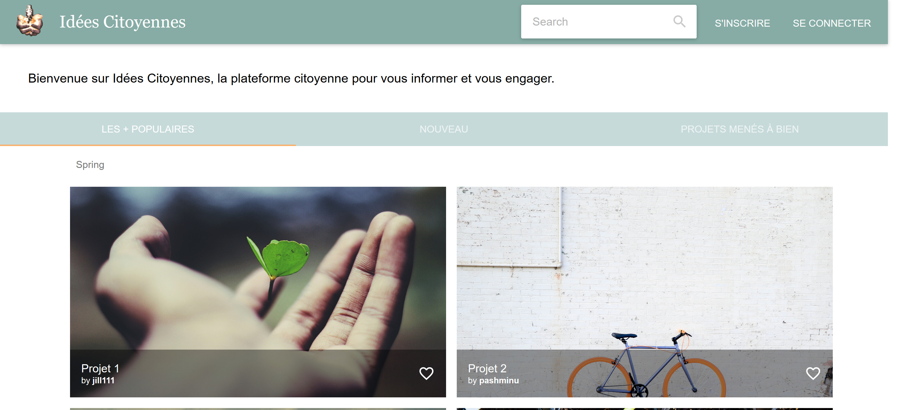
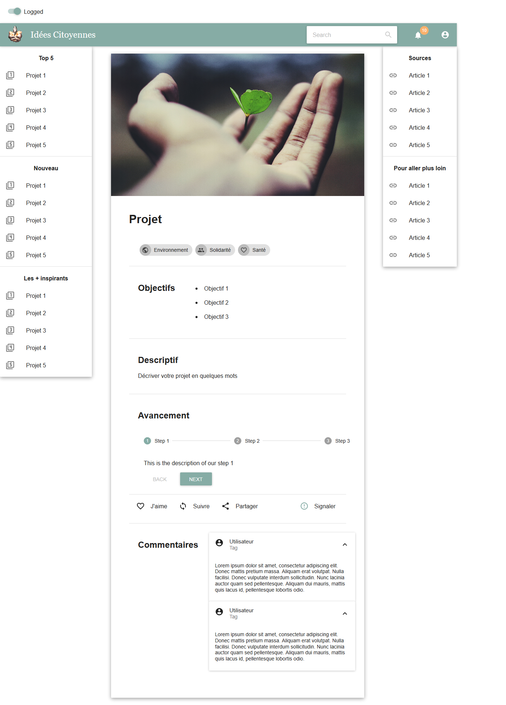

# Idées citoyennes

### Applied project to improve citizen's participation - web platform development

After a market survey and a survey on the way French people view their civic engagement, this repository presents the solution I developed.

## Client
Front-end development using :
- <a href=https://yarnpkg.com/en/>Yarn</a> for dependency management
- <a href=https://nodejs.org/en/ >Node.js</a> - JavaScript runtime
- <a href=https://webpack.js.org/ >Webpack</a> for bundling
- <a href=https://reactjs.org/>React</a> - JavaScript library for building user interfaces
- <a href=https://reacttraining.com/react-router/ >react-router</a> - Declarative routing for React 
- <a href=https://redux.js.org/ >Redux</a> - Predictable state container for JavaScript apps
- <a href=https://material-ui.com/ >Material-ui</a> - React components that implement Google's Material Design.

## Server
Back-end development using :
- <a href=https://www.djangoproject.com/ >Django</a> - High-level Python Web framework
- <a href=http://www.django-rest-framework.org/ >Django Rest Framework</a> - Powerful and flexible toolkit for building Web APIs
- <a href=https://sqlite.org/index.html >SQLite</a> - SQL database engine


## Use

To retrieve the code :   
```$ git clone https://github.com/EstelleBarnoud/sim_project.git```

The back-end is still under development, but you can test the front-end platform by installing <a href=https://yarnpkg.com/en/>Yarn</a> and lauching in the ```client``` directory :   
```
$ yarn install  
$ yarn start
```


## Overview

Main page  

  
  
Project example  



## Further links to the project material

- <a href="https://docs.google.com/presentation/d/1RnNAvNjzGh6oQ6-sDAstRj-NMiArkv8BeuRtYWgJE_4/edit?usp=sharing" >Final presentation in French</a>
- <a href=https://docs.google.com/forms/d/1qLYRHjs99r8n0OHpfjbfPpZexUtsFIgPEA9OIuwmUKI/edit >Survey</a>
